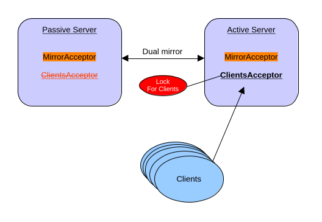

= Lock Coordination
:idprefix:
:idseparator: -
:docinfo: shared

The Lock Coordinator provides pluggable distributed lock mechanism monitoring.
It allows multiple broker instances to coordinate the activation of specific configuration elements, ensuring that only one broker instance activates a particular element at any given time.

When a broker acquires a lock through a distributed lock, the associated configuration elements are activated.
If the lock is lost or released, those elements are deactivated.

In the current version, the Lock Coordinator can be applied to control the startup and shutdown of acceptors.
When an acceptor is associated with a lock coordinator, it will only start accepting connections when the broker successfully acquires the distributed lock.
If lock is lost for any reason, the acceptor automatically stops accepting new connections.

The same pattern used on acceptors may eventually be applied to other configuration elements.
If you have ideas for additional use cases where this pattern could be applied, please file a JIRA issue.

WARNING: This feature is in technical preview and its configuration elements are subject to possible modifications.

== Configuration

It is possible to specify multiple lock-coordinators and associate them with other broker elements.

The broker element associated with a lock-coordinator (e.g., an acceptor) will only be started if the distributed lock can be acquired.
If the lock cannot be acquired or is lost, the associated element will be stopped.

This pattern can be used to ensure clients connect to only one of your mirrored brokers at a time, preventing split-brain scenarios and duplicate message processing.

Depending on the provider selector, multiple configuration options can be provided.
Please consult the javadoc for your lock implementation.
A simple table will be provided in this chapter for the two reference implementations we provide, but this could be a plugin being added to your broker.

In this next example, we configure a broker with:

* Two acceptors: one for mirroring traffic (`for-mirroring-only`) and one for client connections (`for-clients-only`)
* A File-based lock-coordinator named `clients-lock`
* The client acceptor associated with the lock-coordinator, so it only activates when the distributed lock is acquired
* A mirror connection to another broker for data replication

[,xml]
----
<acceptors>
   <acceptor name="for-mirroring-only">tcp://0.0.0.0:61001?tcpSendBufferSize=1048576;tcpReceiveBufferSize=1048576;protocols=CORE,AMQP,STOMP,HORNETQ,MQTT,OPENWIRE;useEpoll=true;amqpCredits=1000;amqpLowCredits=300</acceptor>
   <acceptor name="for-clients-only" lock-coordinator="clients-lock">tcp://0.0.0.0:61616?tcpSendBufferSize=1048576;tcpReceiveBufferSize=1048576;protocols=CORE,AMQP,STOMP,HORNETQ,MQTT,OPENWIRE;useEpoll=true;amqpCredits=1000;amqpLowCredits=300</acceptor>
</acceptors>

<lock-coordinators>
   <lock-coordinator name="clients-lock">
      <type>file</type>
      <lock-id>mirror-cluster-clients</lock-id>
      <check-period>1000</check-period> <!-- how often to check if the lock is still valid, in milliseconds -->

      <properties>
         <property key="locks-folder" value="/usr/somewhere/existing-folder"/>
         <property key="namespace" value="artemis"/>
      </properties>
   </lock-coordinator>
</lock-coordinators>

<broker-connections>
   <amqp-connection uri="tcp://otherBroker:61000" name="mirror" retry-interval="2000">
      <mirror sync="false"/>
   </amqp-connection>
</broker-connections>

----

In the previous configuration, the broker will use a file lock, and the acceptor will only be active if it can hold the distributed lock between the mirrored brokers.

You can find a https://github.com/apache/artemis-examples/tree/main/examples/features/broker-connection/ha-with-mirroring[working example] on how to run HA with Mirroring.

== Configuration Options

=== Common Configuration

The following elements are configured on lock-coordinator

[cols="1,1,1,3"]
|===
|Element |Required |Default |Description

|name
|Yes
|None
|Unique identifier for this lock-coordinator instance, used to reference it from other configuration elements

|type
|Yes
|None
|The lock provider type (e.g., "FILE" or "ZK")

|lock-id
|Yes
|None
|Unique identifier for the distributed lock. All brokers competing for the same distributed lock must use the same lock-id

|check-period
|No
|5000
|How often to check if the lock is still valid, in milliseconds
|===

=== File

The file-based lock uses the file system to manage distributed locks.

[cols="1,1,1,3"]
|===
|Property |Required |Default |Description

|locks-folder
|Yes
|None
|Path to the directory where lock files will be created and managed. The directory must be created in advance before using this lock.
|===

=== ZooKeeper

The ZooKeeper-based lock uses Apache Curator to manage distributed locks via ZooKeeper.

[cols="1,1,1,3"]
|===
|Property |Required |Default |Description

|connect-string
|Yes
|None
|ZooKeeper connection string (e.g., "localhost:2181" or "host1:2181,host2:2181,host3:2181")

|namespace
|Yes
|None
|Namespace prefix for all ZooKeeper paths to isolate data

|session-ms
|No
|18000
|Session timeout in milliseconds

|session-percent
|No
|33
|Percentage of session timeout to use for lock operations

|connection-ms
|No
|8000
|Connection timeout in milliseconds

|retries
|No
|1
|Number of retry attempts for failed operations

|retries-ms
|No
|1000
|Delay in milliseconds between retry attempts
|===
